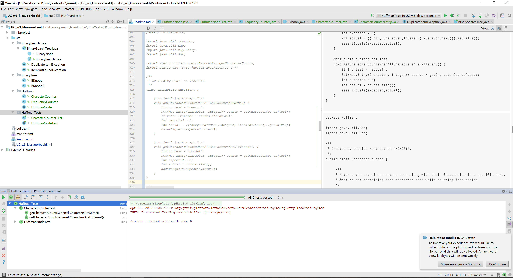
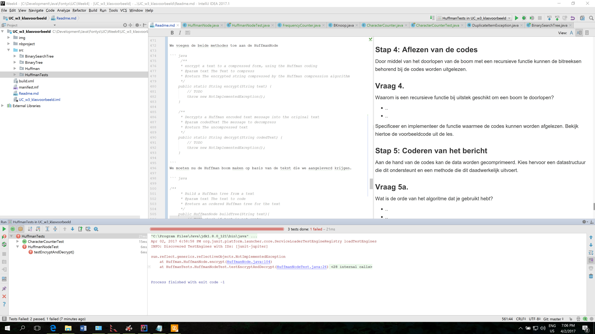

# practicumopdracht: Huffman codering

## Doelstellingen

In deze opdracht komen de volgende onderwerpen aan bod:
 
- Het aanmaken, gebruiken en aanpassen van datastructuren.
- Het sorteren van een datastructuur middels het Java Collections Framework.
- Het bepalen van de orde van een algoritme.
- Het maken en recursief doorlopen van een boom.


## Datacompressie

Een bekende toepassing van (operaties op) datastructuren is datacompressie.
Datacompressie is het op een dusdanige manier representeren van data, dat de hoeveelheid bits benodigd om de data te beschrijven af neemt. De vertaalslag van gecomprimeerde data naar (een benadering van) de oorspronkelijke data wordt decompressie genoemd.

Twee typen compressie kunnen worden onderscheiden:
- Lossless compressie: compressie zonder verlies van data, decompressie levert altijd exact de originele data op. Programma's die gebruik maken van lossless compressie zijn bijvoorbeeld Flac, WinZip en WinRar.
- Lossy compressie: compressie waarbij verlies van data acceptabel wordt geacht als dit tot betere compressie leidt, vaak levert decompressie een benadering van de originele data op. Denk bijvoorbeeld aan JPEG compressie voor foto's, of het comprimeren van muziek met MP3 codering.


## Opdracht

De opdracht omvat het programmeren van een specifieke lossless compressie variant, namelijk Huffmancodering.

Het Huffman algoritme wordt uitgelegd in de Huffman_1,2,3,.. PDFjes en UC_w3_huffman.ppt. Neem eerst deze documenten door om een overzicht te krijgen van de benodigde stappen.
Zoals je kunt lezen bestaat het algoritme uit een zestal stappen. Het is de bedoeling deze stappen te implementeren in Java. Het is daarom ook handig je Java applicatie naar deze stappen in te delen.

Gezien de beschikbare tijd hoeft geen tijd te worden besteed aan een grafische user interface. Hetzelfde geldt voor het inlezen van de te comprimeren data of het wegschrijven van de gecomprimeerde data en codes.

Ga er vanuit dat de te comprimeren data een met de hand gevulde datastructuur is. Bijvoorbeeld een ArrayList gevuld met Character objecten. Voor het tussentijds testen is het handig om een kleine hoeveelheid gemakkelijk te tonen data te gebruiken. Bijvoorbeeld de karakters van een (1) woord.

Tip: aangezien de stappen verder werken met data uit voorgaande stappen is het verstandig om de werking van iedere afzonderlijk stap inzichtelijk te maken. Maak hiervoor unit testen.


### Stap 1: Frequentie van de tekens tellen

Bedenk en specificeer een functie die telt hoe vaak welke karakters voorkomen in de te coderen data (=de frequentie van de karakters). 

De funtie moet:
- voor een gegeven tekst het eerstvolgd karakter nemen.
- het karakter toevoegen aan een groep met hetzelfde karakter, als er geen groep is een nieuwe groep aanmaken
- als alle karakters in de tekst verwerkt zijn het aantal elementen in de groepen tellen
- de tuples met karakter en een aantal sorteren op het aantal. Het tuple met het meeste elelement komt vooraan daarna het tuple met het op een na meeste elementen etc.

Een wat meer formelere functionele implementatie (bijvoorbeeld in F#) ziet er als volgt uit


``` F#

open System

let str = "qwertyuioqqwertyuioqwertyuioasdfgQWERETYUIKMMNBVCXDFGYUIOKL"

let countFreq (s:string) = 
    s.ToCharArray()
    |> Seq.countBy(fun x -> x)
    |> Seq.sortBy(fun (x,y) -> -y) 


[<EntryPoint>]
let main argv = 
    printfn "%A" (countFreq str) |> ignore
    Console.ReadLine() |> ignore
    0 // return an integer exit code


```   

Het reseultaat levert dan de volgende lijst van tuples op

Seq [('q', 4); ('w', 3); ('e', 3); ('r', 3); ...]

#### Vraag 1a. 
Maak unittesten die tenminste 3 relevante inputs testen. Implementeer pas daarna de code. 

##### Test 1
Een test met de lege string

``` java
@Test
void testWithEmptyInput() {
    String str = null;
    List<Char,int> list = countFreq(str);
    int expected = 0;
    int actual = list.size();
    Assert.Equals(expected,actual);
}

```

##### Test 2
Een test met een string met 1 karakter

``` java 

@Test
void testWithSingleCharacter() {

    String str = "A";
    List<Char,int> list = countFreq(str);
    int expected = 1;
    int actual = list.size();
    Assert.Equals(expected,actual);
}

```

##### Test 3
Een test met een string met een x aantal elements is geselecteerd in aflopende orde

``` java

@Test
void frequencyCountIsProperlySorted() {
    String str = "qwertyuioqqwertyuioqwertyuioasdfgQWERETYUIKMMNBVCXDFGYUIOKL";
    List<Char,int> list = countFreq(str);
    bool expected = true;
    bool actual = isSortedInDescendingOrder(list);
    Assert.Equals(expected, actual);
}

bool isSortedInDescendingOrder(List<Char,int> list) {
    Iterator iterator = list.iterator();
    if (!iterator.next()) return true;
    <Char,int> t1 = iterator.next(); //TODO fixed th etype
            while (iter.hasNext()) {
            <Char,int> t2 = iter.next();
            if ((snd t1).compareTo((snd t2)) > 0) {
                return false;
            }
            t1 = t2;
        }
        return true;
}

class FreqNode {
    Char char;
    int i;
    
    FreqNode(Char c, int i){
        char =c;
        this.i = i;
    }
    
    // plus
    
    // fst 
    
    // snd 
}
```

De resultaten van deze functie worden in de volgende stap gesorteerd, dus het is handig om de resultaten als objecten op te slaan in een verzameling die ofwel gesorteerd kan worden, ofwel al gesorteerd is.

#### Vraag 1b. 
Kies zelf een collection waarin je de objecten opslaat die nodig zijn voor het tellen van de frequentie. Beargumenteer je keuze.

Als mogelijke collectie om de resultaten op te slaan komen de volgende structuren in aanmerking:

##### HashMap
- HashMap Het voordeel van een HashMap is dat de toevoeging en telling redelijk eenvoudig is.
Een mogelijke implementatie wordt dan

``` java 

String str = "qwertyuioqqwertyuioqwertyuioasdfgQWERETYUIKMMNBVCXDFGYUIOKL"


static HashMap<Character, Integer> countFreq(String text) {
    char[] chars = text.toCharArray();
    HashMap<Character, Integer> countMap = new HashMap<Character, Integer>();
    for (char aChar : chars) {
        if (countMap.containsKey(aChar)) {
            countMap.put(aChar, countMap.get(aChar) + 1);
        } else {
            countMap.put(aChar,1);
        }
    }

    //sort the occurences ..
    // TODO 
    
    // return the HashMap
    return countMap;
}

```

##### Orde van het algoritme

De orde van de invoeging is O(1) bij een goede keuze van de haskkey, in het slechste geval is het algoritme tussen O(n(log(n))) en O(n^2) zijn.

##### Geheugengebruik en iteraties

Het geheugen gebruik van de HashMap is ongeveer 5 * 255 bytes voor de Hashmap 
- 1 byte voor het opslaan van het karakter (max 255 karakters) en 4 bytes voor het opslaan van het aantal.

Voor geheugen gebruik zijn er bij de quicksort wordt meestal log(n) aangehouden voor het opslaan van de stack frames


##### Array
- Ook voor een Array geldt dat de implementatie eenvoudig en ook het tellen simpel is.
Omdat we kijken naar karakters is de grootte van de array beperkt tot 255 elementen. Een funtie die een karakter omzet naar de Byte waarde bepaalde de positie in de Array.


Een mogelijke implementatie wordt dan

``` java 

String str = "qwertyuioqqwertyuioqwertyuioasdfgQWERETYUIKMMNBVCXDFGYUIOKL"


static Int[] countFreq(String text) {
    char[] chars = text.toCharArray();
    int[] countMap = new int[255]; // already initalizes to 0
    for (char aChar : chars) {
        countMap[(byte) aChar] = count[(byte) aChar] + 1)) 
    }

    //sort the occurences ..
    // TODO 
    
    // return the HashMap
    return countMap;
}

```

##### Orde van het algoritme

De orde van de invoeging is O(1). De sort is even opletten omdat we de waarde van het karakter kwijt raken. 
We zullen dit dus moeten toevoegen aan de data structuur voordat we kunnen sorteren. Dit kost een extra O(1). De sort is vergelijkbaar met de quicksort hierboven. O(n(log(n))) en O(n^2) zijn.

##### Geheugengebruik en iteraties

Het geheugen gebruik van de Array is ongeveer 4 * 255 bytes voor opslaan van de tellingen 

Voor geheugen gebruik zijn er bij de quicksort wordt meestal log(n) aangehouden voor het opslaan van de stack frames


### Stap 2: Tekens op frequentie sorteren

In de vorige stap is bepaald hoe vaak welke karakters voorkomen, of anders gezegd: wat de frequentie van de karakters is. Om gemakkelijk een Huffman-boom te kunnen maken moeten de karakter/frequentie combinaties op frequentie worden gesorteerd.

#### Vraag 2a. 

Kies een datastructuur om je karakters op frequentie te kunnen sorteren. Beargumenteer je keuze.
Erg belangrijk in de keuze van de datastructuur is of we een in-place sortering moeten doen of dat we kunnen invoegen in een externe lijst.
Omdat het hier gaat over relatief kleine lijsten is een mogelijke structuur is een gesorteerde lijst, omdat het aantal verschillend karakters klein is, bjvoorbeeld 255 bij een single byte karakter of 64k bij een twee byte karakter is het eenvoudig om de ene lijst een-voor-een te lezen in in tre voegen in de gesorteerde lijst.
<br>
Op kleine collecties is het meestal sneller om de lijst opnieuw op te bouwen, in de lijst kunnen dubbelen voorkomen, een gesorteerde lijst, hashMap of een Bag is waarschijnlijk de beste oplossing. Een voorbeeld van een implementatie kan dan zijn met een balanced tree (n log(n)) voor  
In het antwoord voor de vorige vraag hadden we een array gebruikt om de frequenties te tellen, waarbij we de byte waarde gebruikte als array index.

Laten we hiervoor nu een nieuwe (generieke) klasse introduceren, gebaseerd op wat we hierboven al met de HashMap hadden gemaakt en wat we nu FrequencyCounter noemen

``` java
package Huffman;

import java.util.HashMap;
import java.util.Set;
import java.util.Map;

/**
 * Created by charles korthout on 4/2/2017.
 */
public class FrequencyCounter<T extends Comparable<T>> {

    private final HashMap<T, Integer> frequencies = new HashMap<>();

    /**
    * Increments the count of the given type,
    * setting it to one on first appearance.
    * @param t the type to count
    */
    public void increment(T t) {
        Integer freq = frequencies.get(t);
        if (freq == null) {
            frequencies.put(t, 1);
        } else {
            frequencies.put(t, freq + 1);
        }
    }

    
    /**
     * Returns the set of types seen along with their frequencies.
     * @return set containing each type seen while counting frequencies
     */
    public Set<Map.Entry<T, Integer>> getCharacterCounts() {
        return frequencies.entrySet();
    }

}

```

We kunnen nu eenvoudig de frequency counter for een stuk tekst maken, met de volgende test stubs.

``` java 
package HuffmanTests;

import java.util.Iterator;
import java.util.Map;
import java.util.Map.Entry;
import java.util.Set;

import static Huffman.CharacterCounter.getCharacterCounts;
import static org.junit.jupiter.api.Assertions.*;

/**
 * Created by charl on 4/2/2017.
 */
class CharacterCounterTest {

    @org.junit.jupiter.api.Test
    void getCharacterCountsWhenAllCharactersAreSame() {
        String test = "aaaaaa";
        Set<Map.Entry<Character, Integer>> counts = getCharacterCounts(test);
        Iterator iterator = counts.iterator();
        int expected = 6;
        int actual = ((Entry<Character,Integer>) iterator.next()).getValue();
        assertEquals(expected,actual);
    }

    @org.junit.jupiter.api.Test
    void getCharacterCountsWhenAllCharactersAreDifferent() {
        String test = "abcdef";
        Set<Map.Entry<Character, Integer>> counts = getCharacterCounts(test);
        int expected = 6;
        int actual = counts.size();
        assertEquals(expected,actual);
    }
}

```

``` java
package Huffman;

import java.util.Map;
import java.util.Set;

/**
 * Created by charles korthout on 4/2/2017.
 */
public class CharacterCounter {

     /**
     * Returns the set of characters seen along with their frequencies in a specific text.
     * @return set containing each character seen while counting frequencies
     */
    public static Set<Map.Entry<Character, Integer>> getCharacterCounts(String text) {
        FrequencyCounter<Character> counts = new FrequencyCounter<>();
        text.chars().forEach( (c) -> counts.increment((char)c));
        return counts.getCounts();
    }
}

```



We hebben nu een structuur die een type en een integer bevat. Een snelle data structuur om de waardes gesorteerd op te slaan is een Binary Search Tree (BST). Hier worden waardes die kleiner zijn in de linker brach opgeslagen en waardes die groter in de rechter branch. In ons voorbeeld is het echter mogelijk dat er dubbelen zijn. We kunnen daarom kiezen om de waardes kleiner <b>of gelijk aan </b> in de linker brach op te nemen en waardes groter in de rechter branch. een tweede mogelijkheid is om een lijst van alle waardes die gelijk zijn aan te houden in de parent.
De laatste zal waarschijnlijk sneller zijn als er veel identieke waardes zijn. Laten we voor de laatste implementatie kiezen.

``` java 
package Huffman;

import java.util.*;
import java.util.Map.Entry;

/**
 * Created by charles korthout on 4/2/2017.
 */
public class HuffmanNode {
    List<Character> chars; // hold the list of all different characters that have the same frequency count
    Integer frequency; // the frequency count
    HuffmanNode leftbranch; // the nodes with frequency counts that are smaller than value
    HuffmanNode rightbranch; // the nodes with frequency counts that are larger than value.

    /**
     * De default constructor.
     * @param character The character to add
     * @param frequency The frequency count
     * @param left the bracnh with values that are smaller than the current frequency count
     * @param right The branch with values that are larger than the current frequency count.
     */
    HuffmanNode(char character, int frequency,  HuffmanNode left,  HuffmanNode right) {
        this.chars = new ArrayList<>();
        chars.add(character);
        this.frequency = frequency;
        this.leftbranch = left;
        this.rightbranch = right;
    }

    List<Character> getCharacters() {
        return chars;
    }

    int getFrequency() {
        return frequency;
    }
```

We moeten er nu ook voor zorgen dat we de HuffmanNode met elkaar kunnen vergelijken, dus we zorgen dat we ook de klass Comparable implementeren

``` java 

public class HuffmanNode implements Comparable<HuffmanNode>{

...

     @Override
     public int compareTo(HuffmanNode node) {
             return frequency - node.frequency; // The old integer compare trick...
     }
     
     @Override
     public boolean equals(Object o) {
         if (null==o) return false;
         if (!(o instanceof HuffmanNode)) return false;
         HuffmanNode node = (HuffmanNode) o;
         return frequency == node.frequency;
     }
     
     @Override
     public int hashCode(){
         return frequency.hashCode();
     }

```

### Huffman testen
Voordat we de daadwerkelijke implementatie van Huffman beginnen is het belangrijk om eerst wat testen te maken van het gedrag dat we verwachten van de Huffman node.
<br>
Uiteindelijk doel is om text te comprimeren (encrypt) en te decomprimeren met decrypt. De decrypt van de encrypt moet het originele bericht opleveren.
Het test bestand kan er dan als volgt uitzien.

``` java
package HuffmanTests;

import Huffman.HuffmanNode;
import static org.junit.jupiter.api.Assertions.*;

/**
 * Created by charles korthout on 4/2/2017.
 */
class HuffmanNodeTest {
    HuffmanNode huffman = null;
    @org.junit.jupiter.api.BeforeEach
    void setUp() {
        
    }

    @org.junit.jupiter.api.AfterEach
    void tearDown() {
    }

    /**
     * The decrypt from the encrypted message must provide the original message
     */
    @org.junit.jupiter.api.Test
    void testEncryptAndDecrypt() {
        String test = "test";
        assertEquals(test, HuffmanNode.decrypt(HuffmanNode.encrypt(test)));
    }
}
```

We voegen de beide methodes toe aan de HuffmanNode

``` java
     /**
     * encrypt a text to a compressed form, using the Huffman coding
     * @param text The Text to compress
     * @return The encrypted string compressed by the Huffman compression algorithm
     */
    public static String encrypt(String text) {
        // TODO
        throw new NotImplementedException();
    }

    /**
     * Decrypts a Huffman encoded text message into the original text
     * @param codedText The message to decompress
     * @return The uncompressed text
     */
    public static String decrypt(String codedText) {
        // TODO
        throw new NotImplementedException();
    }

```
Dit geeft het volgende (verwachte) testresultaat

 

We moeten nu de Huffman boom maken op basis van de tekst die we aangeleverd krijgen.

``` java

/**
     * Build a Huffman tree from a text
     * @param text The text to code
     * @return an ordered Huffman tree for the text
     */
    public HuffmanNode buildTree(String text){
        // TODO check if text is not empty...
        Set<Map.Entry<Character, Integer>> counts = CharacterCounter.getCharacterCounts(text);
        HuffmanNode tree = null;
        Iterator iterator = counts.iterator();
        if (iterator.hasNext()) {
            Entry<Character,Integer> entry = (Entry) iterator.next();
            tree = new HuffmanNode(entry.getKey(),entry.getValue(), null,null);
        }
        while (iterator.hasNext()) {
            Entry<Character,Integer> entry = (Entry) iterator.next();
            HuffmanNode node = new HuffmanNode(entry.getKey(),entry.getValue(), null,null);
            tree.add(node);
        }
        return tree;
    }

```


#### Vraag 2b. Van welke orde is het sorteer algoritme? 
We hebben nu een sorteer algoritme gemaakt. Het eerste gedeelte het lezen van de text is O(1). Het invoegen van in de boom is order log(n). (We beschouwen het toevoegen aan de lijst bij gelijkheid ook O(1)).Het opzetten is dus O(log(n))


#### Vraag 2c. Hoe geef je aan waarop er gesorteerd moet worden?
Er word gesorteerd op basis van het aantal maal dat een karakter voor komt in de tekst. Dit wordt eerst opgeslagen in een HashMap en daarna worden de elementen toegevoegd aan een BST met een lijst implementatie voor gelijkheid.

Een ander mogelijkheid is om gebruik te maken van een gesorteerde collection, bijvoorbeeld een PriorityQueue van het Java Collection Framework om de elementen gesorteerd op te vragen. Bestudeer de mogelijkheden van de PriorityQueue om een goede keuze kunnen maken.

Zorg er voor dat de lijst met karakter/frequentie combinaties op frequentie kan worden gesorteerd met behulp van het Java Collections framework.


### Stap 3: Maken van de Huffman-boom

Nu we de lijst kunnen sorteren kan de Huffman-boom worden opgebouwd. Specificeer hiertoe een methode die dit kan, en maak hiervoor unittests (goede testcases kunnen zijn hoe je vanuit fig 6.26 naar fig 6.27 komt (en verder). Creeer pas daarna de code.

Tijdens het maken van een boom vervang je telkens twee knopen door een nieuwe knoop met de originele knopen als kinderen. Door op het moment van samenvoegen uitvoer te genereren kun je achterhalen hoe de boom eruit ziet.

#### Vraag 3a. 
Maak een tekening van de boom. Vermeld bij iedere knoop de frequentie, en bij ieder blad de bijbehorende code. 

#### Vraag 3b: 
Wat is de benaming voor het type boom dat je getekend hebt? Waarom?
- ..
- ..


### Stap 4: Aflezen van de codes

Door middel van het doorlopen van de boom met een recursieve functie kunnen de bitreeksen behorend bij de codes worden uitgelezen.

### Vraag 4. 
Waarom is een recursieve functie bij uitstek geschikt om een boom te doorlopen?
- ..
- ..

Specificeer en implementeer de functie waarmee de codes kunnen worden afgelezen. Bekijk hiertoe de voorbeeldcode uit de les.


### Stap 5: Coderen van het bericht

Aan de hand van de codes kan de data worden gecomprimeerd. Kies hervoor een datastructuur die dit ondersteunt en een methode die dit daadwerkelijk uitvoert.
 
### Vraag 5a. 
Wat is de orde van het algoritme dat je gebruikt hebt? 
- ..
- ..

In principe zou je stap 4 over hebben kunnen slaan en voor iedere te comprimeren karakter de code in de boom hebben kunnen opzoeken. 

### Vraag 5b. 
Waarom zou stap 4 in het algoritme zijn opgenomen? 
- ..
- ..
- .. 

Vergelijk de grootte in bits van de gecomprimeerde en gedecomprimeerde data. Tel hierbij elk character dat een bit voorstelt als ��n bit (dus niet als character van 8 of 16 bits). 
### Optioneel:
Indien je elke codering echt bit voor bit wilt opslaan i.p.v. als een string, gebruik dan een BitSet. 


### Stap 6: Decoderen

Aan de hand van de boom of lijst van codes kun je het gecomprimeerde bericht weer decomprimeren tot de originele data.

Kies hervoor een datastructuur die dit ondersteunt en een methode die dit daadwerkelijk uitvoert. Deze methode moet van orde O(n) zijn, waarbij n het aantal gecomprimeerde tekens in het bericht is.


